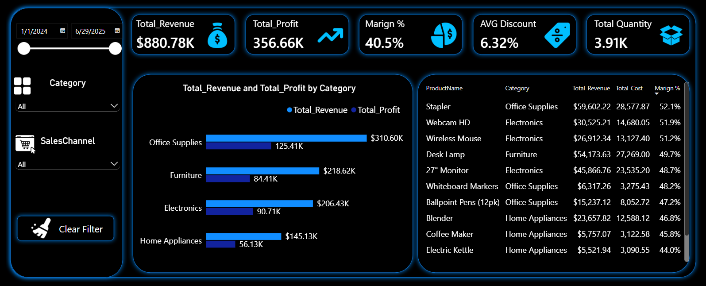

# Sales Performance Analysis — Excel & Power BI

End-to-end sales analytics project: cleaning messy transactional data, building a relational data model, and delivering an interactive Power BI dashboard with actionable business insights.

## 🛠️ Tools & Skills

- **Excel**: Power Query (data cleaning), PivotTables, VLOOKUP/INDEX-MATCH
- **Power BI**: Data Modeling (Star Schema), DAX (SUMX, RELATED, CALCULATE, DIVIDE), interactive dashboards
- **Core skills demonstrated**: data cleaning, relational modeling, time intelligence, root-cause analysis

## 📊 About the Dataset

The dataset simulates 18 months of sales transactions (Jan 2024 – Jun 2025) across 4 product categories, 4 sales channels, 6 sales reps, and 12 Egyptian cities — 1,200 unique transactions linked to Products and Customers lookup tables.

The data was **intentionally seeded with real-world data quality issues** to demonstrate cleaning skills, not just analysis:
- Duplicate records
- Missing values (blank discounts)
- Inconsistent text formatting (e.g., "Online" vs "online" vs "In-Store" vs "In store")

## 📈 Dashboard Overview

The dashboard has 3 pages: **Overview** (KPIs and top-level breakdowns), **Sales Performance Analysis** (categories, channels, reps, and the monthly/quarterly trend), and **Geographical Sales Analysis** (city-level performance).

## 🔑 Key Findings

**Categories**
Office Supplies is the strongest category overall — highest revenue (~311K), highest total profit, and highest quantity sold. Electronics has the best margin (44%), making it the most capital-efficient category with real growth potential. Home Appliances has by far the lowest profit per unit (~61) — likely a supplier cost issue rather than a pricing or demand problem — while Furniture sells the fewest units of any category and posts a similarly thin margin (~39%).

**Sales Channels**
Online is the strongest channel by a clear margin — highest revenue, highest quantity, and highest total profit. Margins are nearly identical across all four channels (40–41%), meaning the decision here is about volume, not efficiency.

**Sales Reps**
Mona Adel leads in revenue and profit, though Rania Kamal is close behind and actually edges ahead on units sold. Ahmed Salah has the best margin (41.5%) despite giving a higher average discount than Mona — a deep dive into category-level performance shows his edge is spread across 3 of the 4 categories rather than tied to one clear cause. Rania Kamal has the weakest margin (39.1%) among named reps, concentrated especially in the Furniture category (36.2%) — not driven by higher discounting, since her average discount sits close to the team average, pointing to a pricing/negotiation skill gap worth coaching.

**Monthly & Quarterly Trend**
Revenue climbs through 2024, peaking in Q4 2024 (177K) — the strongest quarter in the dataset, driven by November 2024 (63.5K) and January 2025 (62.0K). Three seasonal dips recur at a similar ~31–32K floor: April 2024, February 2025, and June 2025 (a partial month) — a pattern that repeats closely enough across different points in the year to suggest real, recurring seasonality rather than noise. October through January is consistently the strongest stretch each year.

**Cities**
Luxor, Damietta, and Aswan are the top-performing cities, with Office Supplies dominating as the top category in 9 of the 12 cities — confirming it as a "staple" product with universal demand. Cairo and Giza — expected to be the largest markets — significantly underperform relative to their size (Cairo ranks only 5th and is the one city where Furniture, not Office Supplies, leads; Giza is last by a wide margin despite having the highest margin of any city), suggesting a sales coverage gap worth investigating rather than a real demand issue.

## 📁 Repository Contents

| File | Description |
|---|---|
| `تقرير_تحليل_المبيعات_الشامل.md` | Full detailed analysis report (all 5 business questions) |
| `Sales_Performance.xlsx` | Raw dataset (Sales, Products, Customers tables) |
| `Project Sales.pbix` | Power BI dashboard file |
| `screenshots/` | Dashboard page exports |

## 🖼️ More Dashboard Pages

**Sales Performance Analysis**

**Geographical Sales Analysis**

