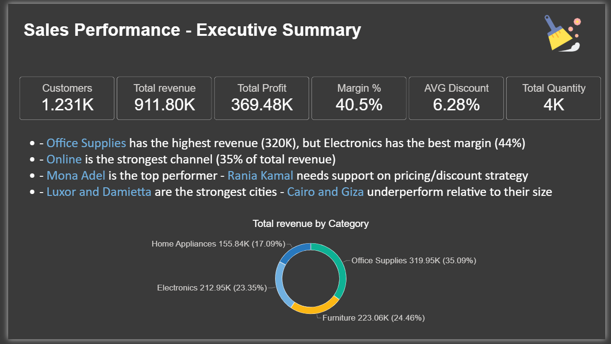
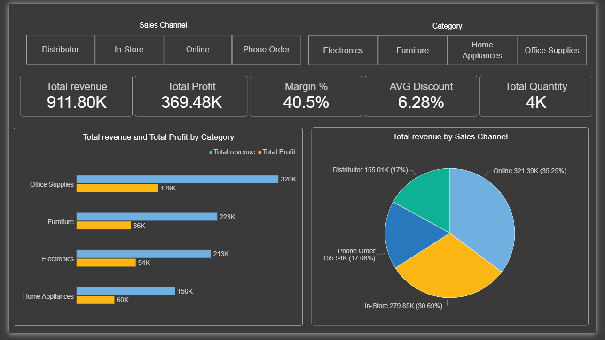
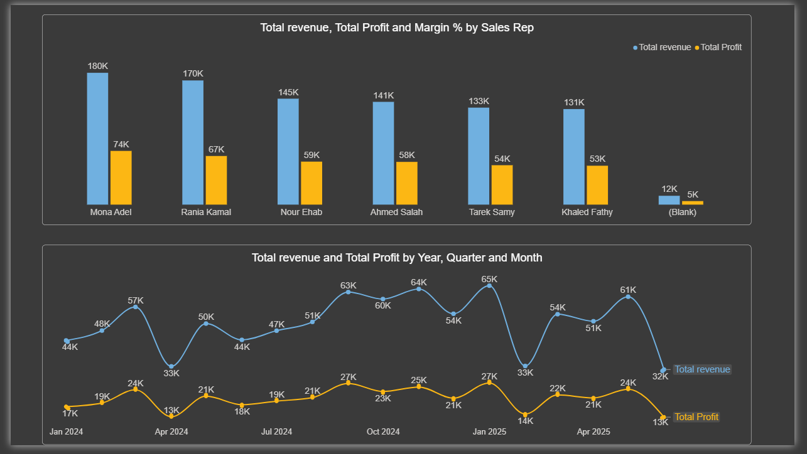
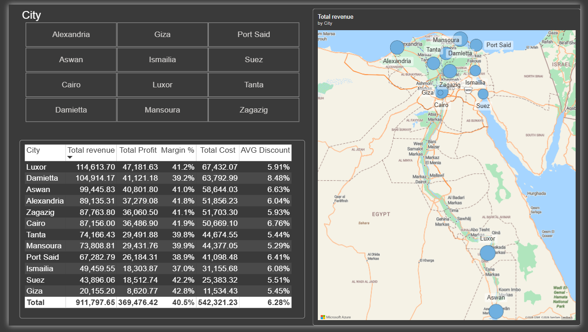

# Sales Performance Analysis — Excel & Power BI

End-to-end sales analytics project: cleaning messy transactional data, building a relational data model, and delivering an interactive Power BI dashboard with actionable business insights.

## 🛠️ Tools & Skills

- **Excel**: Power Query (data cleaning), PivotTables, VLOOKUP/INDEX-MATCH
- **Power BI**: Data Modeling (Star Schema), DAX (SUMX, RELATED, CALCULATE, DIVIDE), interactive dashboards
- **Core skills demonstrated**: data cleaning, relational modeling, time intelligence, root-cause analysis

## 📊 About the Dataset

The dataset simulates 18 months of sales transactions (Jan 2024 – Jun 2025) across 4 product categories, 4 sales channels, 6 sales reps, and 12 Egyptian cities — ~1,200 transactions linked to Products and Customers lookup tables.

The data was **intentionally seeded with real-world data quality issues** to demonstrate cleaning skills, not just analysis:
- Duplicate records
- Missing values (blank discounts)
- Inconsistent text formatting (e.g., "Online" vs "online" vs "In-Store" vs "In store")

## 📈 Dashboard Overview

## 🔑 Key Findings

**Categories**
Office Supplies is the strongest category overall — highest revenue (320K), highest total profit, and highest quantity sold. However, Electronics has the best margin (44%), making it the most capital-efficient category with real growth potential. Home Appliances is the weakest across almost every metric, with by far the lowest profit per unit — likely a supplier cost issue rather than a pricing or demand problem.

**Sales Channels**
Online is the strongest channel by a clear margin — highest revenue, highest quantity, and highest total profit. Margins are nearly identical across all four channels (40–41%), meaning the decision here is about volume, not efficiency.

**Sales Reps**
Mona Adel leads in overall volume (revenue, profit, and quantity). Ahmed Salah has the best margin (41.6%) despite giving a higher average discount than Mona — a deep dive into category-level performance showed his edge is spread thinly across products rather than tied to one clear cause. Rania Kamal has the weakest margin (39%) consistently across nearly all categories — not driven by higher discounting, pointing instead to a broader pricing/negotiation skill gap worth coaching.

**Monthly Trend**
⚠️ A key methodological catch: the first version of this chart grouped months without separating years, silently merging Jan–Jun 2024 with Jan–Jun 2025 into single data points — creating a misleading "sharp drop" that wasn't real. After rebuilding the timeline with a proper Year+Month axis, the corrected trend shows steady overall growth (44K → peak of 65K), a recurring seasonal dip around April/June, and Q4 (Oct–Jan) consistently the strongest period.

**Cities**
Luxor, Damietta, and Aswan are the top-performing cities, with Office Supplies dominating as the top category in most cities — confirming it as a "staple" product with universal demand. Cairo and Giza — expected to be the largest markets — significantly underperform relative to their size, suggesting a sales coverage gap worth investigating rather than a real demand issue.

## 📁 Repository Contents

| File | Description |
|---|---|
| `تقرير_تحليل_المبيعات_الشامل.md` | Full detailed analysis report (all 5 business questions) |
| `Sales_Practice_Data.xlsx` | Raw dataset (Sales, Products, Customers tables) |
| `Project Sales.pbix` | Power BI dashboard file |
| `screenshots/` | Dashboard page exports |

## 🖼️ More Dashboard Pages

**Category & Channel Performance**

**Team & Time Trend**

**Geographic Performance**

